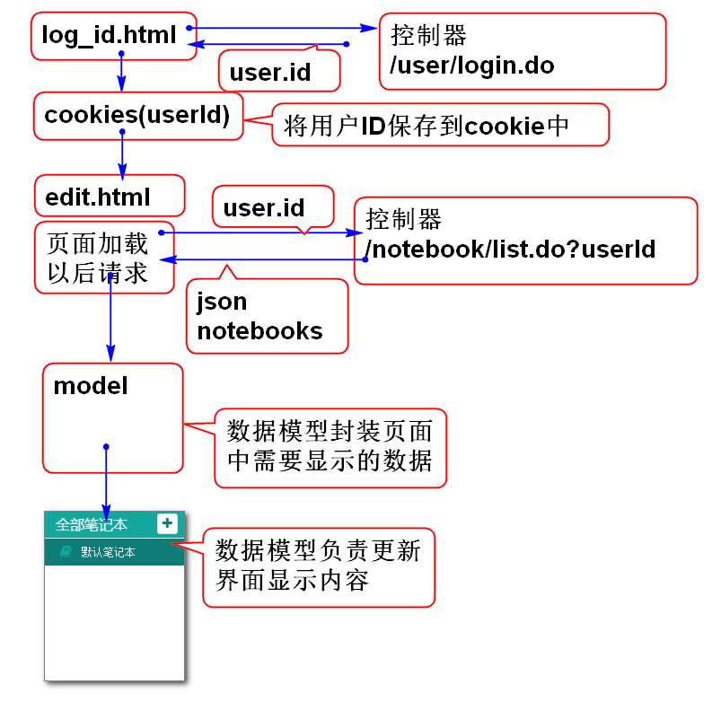

# 云笔记

## 实现笔记本列表功能

思考步骤：

1. 先了解笔记本列表业务功能。
2. 再思考实现笔记本列表功能的数据存储位置，以及如何查询才能实现这个功能。
3. 思考如果利用3层结构实现这个查询功能
	- 数据层负责执行SQL
	- 业务层负责处理业务规则
	- 表现层负责数据展现 

实现原理：

实现步骤：

1. 实现数据层方法并且测试
2. 实现业务层方法并且测试
3. 实现控制器方法并且测试
4. 在HTML中利用Ajax调用控制器

### 1. 实现数据层方法并且测试

添加数据层接口方法 NotebookDao.java：
	
	public interface NotebookDao {
		List<Map<String, Object>>
			findNotebooksByUserId(String userId);
	}

添加数据层接口SQL语句 NotebookMapper.xml:

	<?xml version="1.0" encoding="UTF-8" ?>  
	<!DOCTYPE mapper PUBLIC "-//ibatis.apache.org//DTD Mapper 3.0//EN"      
	 "http://ibatis.apache.org/dtd/ibatis-3-mapper.dtd">
	<mapper namespace="cn.tedu.note.dao.NotebookDao">
		<!-- 返回值 List<Map<String, Object>> 
		resultType 定义返回值List中每个元素的类型
		-->
		<select id="findNotebooksByUserId"
			resultType="map"
			parameterType="string">
			select 
				cn_notebook_id as "id",
				cn_notebook_name as "name"
			from
				cn_notebook
			where
	 			cn_user_id = #{userId}
		</select>
	</mapper>

测试：	
	
	
	@Test
	public void testFindNotebookByUserId(){
		//select cn_user_id 
		// from cn_notebook;
		String userId="ea09d9b1-ede7-4bd8-b43d-a546680df00b";
		NotebookDao dao = ctx.getBean(
			"notebookDao",
			NotebookDao.class);
		List<Map<String, Object>> list=
			dao.findNotebooksByUserId(userId);
		for (Map<String, Object> n : list) {
			System.out.println(n); 
		}
	}

### 2. 实现业务层方法并且测试

添加业务层方法：

	public interface NotebookService {
		
		List<Map<String, Object>> 
			listNotebooks(String userId)
			throws UserNotFoundException;
	}

> 提示： 业务层异常类UserNotFoundException请自行添加

实现业务层方法：

	@Service("notebookService")
	public class NotebookServiceImpl
		implements NotebookService{
		
		@Resource
		private NotebookDao notebookDao;
		
		@Resource
		private UserDao userDao;
		
		public List<Map<String, Object>> 
			listNotebooks(String userId) 
			throws UserNotFoundException {
			if(userId==null||userId.trim().isEmpty()){
				throw new UserNameException("id空");
			}
			User user = userDao.findUserById(userId);
			if(user==null){
				throw new UserNameException("查无此人");
			}
			return notebookDao
				.findNotebooksByUserId(userId);
		}
	}

测试：

	@Test
	public void testListNotebooks(){
		String userId="ea09d9b1-ede7-4bd8-b43d-a546680df00b";
		NotebookService service = ctx.getBean(
			"notebookService",
			NotebookService.class);
		List<Map<String, Object>> list = 
			service.listNotebooks(userId);
		for (Map<String, Object> n : list) {
			System.out.println(n); 
		}
	}

### 3. 实现控制器方法并且测试

添加抽象控制器，用于封装控制器中通用的方法：

	public abstract class AbstractController {
		
		@SuppressWarnings("rawtypes")
		@ExceptionHandler
		@ResponseBody
		public JsonResult exp(Exception e){
			e.printStackTrace();
			return new JsonResult(e);
		}
	}
 
> 提示： 有了抽象控制器，封装了通用异常处理方法，子类中就可以不再处理异常了。

创建笔记本控制器 NotebookController.java:

	@Controller
	@RequestMapping("/notebook")
	public class NotebookController
		extends AbstractController{
		
		@Resource
		private NotebookService notebookService;
		
		@RequestMapping("/list.do")
		@ResponseBody
		public JsonResult<List<Map<String, Object>>> 
			list(String userId){
			List<Map<String, Object>> list=
				notebookService.listNotebooks(userId);
			return new JsonResult<List<Map<String,Object>>>(list);
		}
	
		
	}

> 继承了抽象控制器

测试：

	浏览器请求：
	http://localhost:8080/note/notebook/list.do?userId=ea09d9b1-ede7-4bd8-b43d-a546680df00b
	
	结果：
	{"state":0,"data":[{"name":"push","id":"1755013b-05fc-4218-83cf-956287a81b49"},{"name":"action","id":"1ecf916f-61b8-409a-8173-1e548ac65d89"},{"name":"笔记1","id":"b6887c05-7316-4088-8d67-c451f1474575"},{"name":"笔记2","id":"cce17f11-6b90-4a17-87a2-74df0f5d4991"},{"name":"favorites","id":"db31c93f-957f-4f3c-ae67-cd443d5c0d06"},{"name":"recycle","id":"e46239d6-4f54-426c-a448-f7a0d45f9425"}],"message":""}

	请求：
	http://localhost:8080/note/notebook/list.do
	结果：
	{"state":1,"data":null,"message":"id空"}

重构 UserController.java:

	@Controller
	@RequestMapping("/user")
	public class UserController 
		extends AbstractController{
		
		@Resource
		private UserService userService;
		
		@RequestMapping("/login.do")
		@ResponseBody
		public JsonResult<User> login(String name,
				String password){
			User user = 
				userService.login(name, password);
			return new JsonResult<User>(user);
		}
			 
		//UserController.java
		@RequestMapping("/regist.do")
		@ResponseBody
		public JsonResult<User> regist(
				String name, String nick, 
				String password, String confirm){
			User user = userService
				.regist(name, nick,
				password, confirm);
			return new JsonResult<User>(user);
		}
		
		@SuppressWarnings("rawtypes")
		@ExceptionHandler(
				UserNameException.class)
		@ResponseBody
		public JsonResult userName(
				UserNameException e){
			e.printStackTrace();
			return new JsonResult(2, e);
		}
		
		@SuppressWarnings("rawtypes")
		@ExceptionHandler(PasswordException.class)
		public JsonResult password(
				PasswordException e){
			e.printStackTrace();
			return new JsonResult(3, e);
		}
	}

> 提示：继承于抽象控制器，删除通用异常处理方法

### 4. 在HTML中利用Ajax调用控制器

原理：

1.重构log_in.html,引入cookie_util.js:

	

2.重构login.js，在登录成功时候将用户ID保存到cookie中(局部)：

	...
	if(result.state==0){//SUCCESS
		console.log("SUCCESS");
		console.log(result.data);
		var user = result.data;
		setCookie('userId',user.id);
		location.href='edit.html';
		return;
	...

3.重构edit.html的尾部，引入js脚本：

	
	<!-- 页面初始化脚本 -->
		 
	<!-- 笔记本有关的脚本 -->
	<script type="text/javascript"
		src="scripts/edit_notebook.js"></script

> 提示： 引入位置在其他JS脚本之后，其中	 edit_init.js 和 edit_notebook.js 是后续添加的脚本。

3.添加edit_init.js脚本文件。

	// edit_init.js 初始化
	
	var SUCCESS=0; //全局常量
	
	var model = {};//当前页面中的数据模型
	
	$(function(){
		//console.log('init()');
		//页面加载以后，立即加载笔记本列表
		loadNotebooksAction();//edit_notebook.js
	});

4.添加edit_notebook.js脚本：
	
	/*
	 * edit_notebook.js  
	 * 封装与笔记本有关的操作方法 
	 */
	
	function loadNotebooksAction(){
		//console.log('loadNotebooksAction()');
		var url='notebook/list.do';
		var data={userId:getCookie('userId')};
		console.log(data);
		console.log(url);
		$.getJSON(url, data, function(result){
			if(result.state==SUCCESS){
				var list=result.data;
				console.log(list); 
				model.updateNotebooks(list);
			}
		});
	}
	
	/*
	 * <li class="online">
		<a  class="checked">
		<i class="fa fa-book" title="online" rel="tooltip-bottom">
		</i> 默认笔记本</a></li>
	 */
	model.updateNotebooks=function(list){
		var template='<li class="online">'+
			'<a>'+
			'<i class="fa fa-book" title="online" rel="tooltip-bottom"></i>'+
			'[notebook.name]</a></li>';
		
		this.notebooks=list;
		console.log(this);
		var ul=$('#notebooks').empty();
		for(var i=0;i<this.notebooks.length;i++){
			var notebook=this.notebooks[i];
			// id name
			var li=template.replace(
				'[notebook.name]', notebook.name);
			li = $(li);
			ul.append(li);
		}
	};
	
> 提示：添加一部分代码就进行单元测试，避免全部添加完成再统一测试。

5.重构edit.html，在笔记本列表区域的UL元素上添加id属性, 局部代码如下：

	...
	<ul class="contacts-list" id="notebooks">
		<li class="online">
		<a  class='checked'>
		<i class="fa fa-book" title="online" rel="tooltip-bottom">
		</i> 默认笔记本</a></li>
	</ul>
	... 
	
> 提示：添加id="notebooks"用于在updateNotebooks方法中查找到 ul 元素。

## GOOD LUCK！
---------------------------------------
## 作业

完成笔记本列表显示功能。
