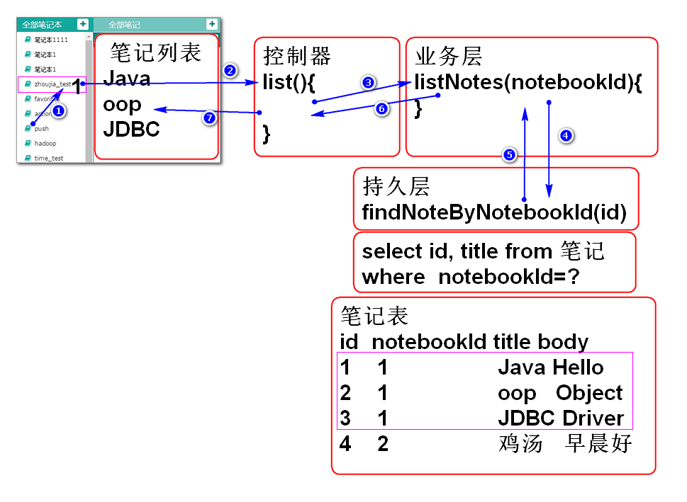
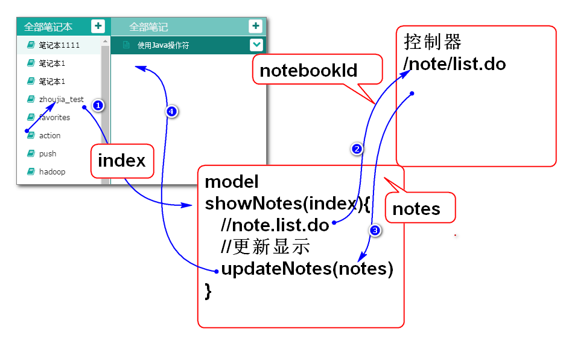

# 云笔记

## 显示笔记列表功能

原理：

实现步骤：

1. 编写数据层方法并且测试
2. 编写业务层方法并且测试
3. 编写控制器并且测试
4. 编写JS脚本利用AJAX访问控制器

### 1. 编写数据层方法并且测试

编写数据层接口：

	public interface NoteDao {
		/**
		 * 根据笔记本ID查询全部的笔记信息
		 * @param notebookId
		 * @return
		 */
		List<Map<String, Object>> 
			findNotesByNotebookId(
			String notebookId);
	
	}

添加Mapper文件

	<?xml version="1.0" encoding="UTF-8" ?>  
	<!DOCTYPE mapper PUBLIC "-//ibatis.apache.org//DTD Mapper 3.0//EN"      
	 "http://ibatis.apache.org/dtd/ibatis-3-mapper.dtd">
	<mapper namespace="cn.tedu.note.dao.NoteDao">
		<select id="findNotesByNotebookId"
			parameterType="string"
			resultType="map">
			select
				cn_note_id as id,
				cn_note_title as title	
			from
				cn_note
			where
				cn_notebook_id=#{notebookId}
			order by
				cn_note_create_time desc
		</select>
	</mapper>

测试：

	@Test
	public void testFindNotesByNotebookId(){
		// select cn_notebook_id from cn_note;
		String id="d0e7ce0d-4893-4705-a51a-9a73d259bc70";
		NoteDao dao = ctx.getBean(
			"noteDao", NoteDao.class);
		List<Map<String, Object>> list=
			dao.findNotesByNotebookId(id);
		for(Map<String, Object> n:list){
			System.out.println(n); 
		}
	}

### 2. 编写业务层方法并且测试

编写业务层方法：

	public interface NoteService {
		List<Map<String, Object>>
			listNotes(String notebookId)
			throws NotebookNotFoundException;
	}

实现业务层方法：
	
	@Service("noteService")
	public class NoteServiceImpl 
		implements NoteService{
		
		@Resource
		private NoteDao noteDao;
		
		@Resource 
		private NotebookDao notebookDao;
		
		public List<Map<String, Object>> listNotes(
				String notebookId)
				throws NotebookNotFoundException {
			if(notebookId==null ||
					notebookId.trim().isEmpty()){
				throw new NotebookNotFoundException("id空");
			}
			Notebook notebook = notebookDao
				.findNotebookById(notebookId);
			if(notebook==null){
				throw new NotebookNotFoundException("不存在");
			}
			return noteDao.findNotesByNotebookId(notebookId);
		}
	}

> 提示：业务方法中用到了 Notebook类 和 findNotebookById 方法，需要重构项目，添加相应的类和方法。

添加实体类Notebook：

	public class Notebook implements Serializable{
		private static final long serialVersionUID = -4381547598594105040L;
	
		private String id;
		private String userId;
		private String typeId;
		private String name;
		private String desc;
		private Timestamp createTime;
		
		public Notebook() {
		}
	
		
		 
		public Notebook(String id, String userId, String typeId, String name, String desc, Timestamp createTime) {
			super();
			this.id = id;
			this.userId = userId;
			this.typeId = typeId;
			this.name = name;
			this.desc = desc;
			this.createTime = createTime;
		}
	
	
	
		public String getId() {
			return id;
		}
	
		public void setId(String id) {
			this.id = id;
		}
	
		public String getUserId() {
			return userId;
		}
	
		public void setUserId(String userId) {
			this.userId = userId;
		}
	
		public String getName() {
			return name;
		}
	
		public void setName(String name) {
			this.name = name;
		}
	
		public String getDesc() {
			return desc;
		}
	
		public void setDesc(String desc) {
			this.desc = desc;
		}
	
		public Timestamp getCreateTime() {
			return createTime;
		}
	
		public void setCreateTime(Timestamp createTime) {
			this.createTime = createTime;
		}
	
		public String getTypeId() {
			return typeId;
		}
	
	
	
		public void setTypeId(String typeId) {
			this.typeId = typeId;
		}
	
		
	
		@Override
		public String toString() {
			return "Notebook [id=" + id + ", userId=" + userId + ", typeId=" + typeId + ", name=" + name + ", desc=" + desc
					+ ", createTime=" + createTime + "]";
		}
	
	
	
		@Override
		public int hashCode() {
			final int prime = 31;
			int result = 1;
			result = prime * result + ((id == null) ? 0 : id.hashCode());
			return result;
		}
	
		@Override
		public boolean equals(Object obj) {
			if (this == obj)
				return true;
			if (obj == null)
				return false;
			if (getClass() != obj.getClass())
				return false;
			Notebook other = (Notebook) obj;
			if (id == null) {
				if (other.id != null)
					return false;
			} else if (!id.equals(other.id))
				return false;
			return true;
		}
		
	}

在NotebookDao中添加方法 findNotebookById:

	Notebook findNotebookById( String notebookId);

在 NotebookMapper.xml 添加SQL语句：

	<select id="findNotebookById"
		parameterType="string"
		resultType="cn.tedu.note.entity.Notebook">
		select 
			cn_notebook_id as id,
			cn_user_id as userId,
			cn_notebook_type_id as typeId,
			cn_notebook_name as name,
			cn_notebook_desc as "desc",
			cn_notebook_createtime as createTime
		from
			cn_notebook
		where
			cn_notebook_id=#{notebookId}
	</select>

测试：

	@Test
	public void testListNotes(){
		String id="d0e7ce0d-4893-4705-a51a-9a73d259bc70";
		NoteService service = ctx.getBean(
			"noteService", NoteService.class);
		List<Map<String, Object>> list=
			service.listNotes(id);
		for (Map<String, Object> n : list) {
			System.out.println(n);
		}
	}
	
### 3. 编写控制器并且测试

编写控制器类 NoteController.java：

	@Controller
	@RequestMapping("/note")
	public class NoteController
		extends AbstractController{
	
		@Resource
		private NoteService noteService;
		
		@RequestMapping("/list.do")
		@ResponseBody
		public JsonResult<List<Map<String, Object>>>
			list(String notebookId){
			List<Map<String, Object>> list=
				noteService.listNotes(notebookId);
			return new JsonResult<List<Map<String,Object>>>(list);
		}
	}

利用浏览器进行测试：

	请求：
	http://localhost:8080/note/note/list.do?notebookId=d0e7ce0d-4893-4705-a51a-9a73d259bc70
	http://localhost:8080/note/note/list.do?notebookId=d0e
	http://localhost:8080/note/note/list.do 
	
### 4. 编写JS脚本利用AJAX访问控制器

原理:

1.更新初始化脚本edit_init.js 绑定笔记本列表点击事件：

	$(function(){
		//console.log('init()');
		//页面加载以后，立即加载笔记本列表
		loadNotebooksAction();//edit_notebook.js
		//绑定点击笔记本列表的事件
		//showNotesAction函数定义在edit_note.js中
		$('#notebooks').on('click','li', showNotesAction);
	});

> 提示：事件处理方法showNotesAction定义在脚本文件edit_note.js中。

2.重构edit_notebook.js中updateNotebooks方法，在每个里上绑定序号 index：

	...
	//在DOM对象上绑定数据 index
	li = $(li).data('index',i);
	...

3.重构edit.html文件引入脚本文件 edit_note.js:

	...
	<!-- 笔记有关的脚本 -->
		 
	...

4.添加edit_note.js文件，添加事件绑定处理方法：

	function showNotesAction(){
		//this 是 li 元素
		//console.log(this);
		//获取选中元素的 序号，此序号是在显示
		//笔记本列表时候绑定的。
		var li = $(this);
		var index = li.data('index');
		//console.log(index);
		//处理视觉效果
		li.parent().find('a')
			.removeClass('checked');
		li.find('a').addClass('checked');
		//让模型显示当前笔记本的全部笔记
		model.showNotes(index);
	}

> 提示：事件处理方法中index来自updateNotebooks方法中绑定的序号位置index。

5.在edit_note.js文件中为model对象添加showNotes方法：

	//显示选定笔记本的全部笔记
	model.showNotes=function(notebookIndex){
		console.log(notebookIndex);
		//找到当前笔记本信息
		console.log(this);//model 对象
		var notebook=
			this.notebooks[notebookIndex];
		console.log(notebook);
		//向服务器发起Ajax请求获取笔记列表
		var url = "note/list.do";
		var data = {notebookId:notebook.id};
		//console.log(data);
		$.getJSON(url, data, function(result){
			if(result.state==SUCCESS){
				//console.log(result.data);
				//更新笔记列表
				model.updateNotes(result.data);
			}else{
				alert(result.message);
			}
		});
	}

>这个方法向服务器发起请求获取笔记列表信息。

6.重构edit.html为笔记列表显示区域添加ID：

	...
	<ul class="contacts-list" id="notes">
	...
		
7.在edit_note.js文件中为model对象添加updateNotes方法，这个方法负责将笔记信息显示到笔记列表区域。

	//将 notes 显示到界面
	model.updateNotes = function(notes){
		
		//显示模板
		var template='<li class="online">'+
			'<a>'+
				'<i class="fa fa-file-text-o" title="online" rel="tooltip-bottom"></i>[note.title]<button type="button" class="btn btn-default btn-xs btn_position btn_slide_down"><i class="fa fa-chevron-down"></i></button>'+
			'</a>'+
			'
'+
				'<dl>'+
					'<dt><button type="button" class="btn btn-default btn-xs btn_move" title="移动至..."><i class="fa fa-random"></i></button></dt>'+
					'<dt><button type="button" class="btn btn-default btn-xs btn_share" title="分享"><i class="fa fa-sitemap"></i></button></dt>'+
					'<dt><button type="button" class="btn btn-default btn-xs btn_delete" title="删除"><i class="fa fa-times"></i></button></dt>'+
				'</dl>'+
			'
'+
			'</li>';
		
		console.log(notes);
		this.notes = notes;
		var ul=$('#notes').empty();
		for(var i=0; i<this.notes.length; i++){
			var note=this.notes[i];
			var li = template.replace(
				'[note.title]', note.title);
			li = $(li);
			ul.append(li);
		}
	};

8.测试

----------------------------

## 作业

完成笔记列表功能

