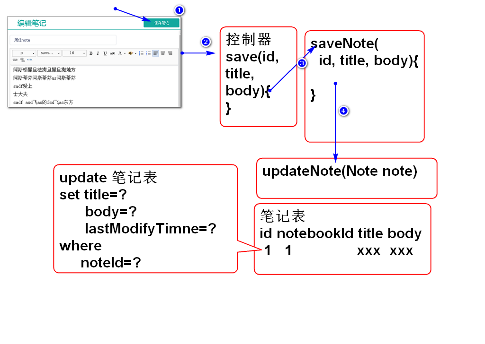
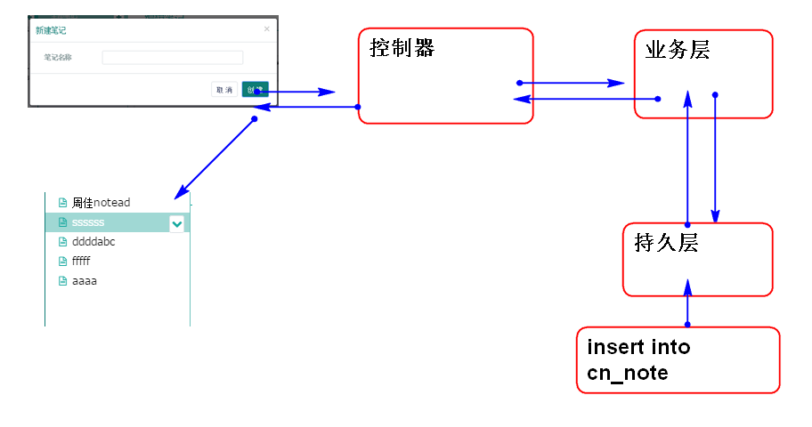

# 云笔记

## 保存笔记功能

原理：

步骤：

1. 编写数据层方法并且测试
2. 编写业务层方法并且测试
3. 编写控制器
5. 编写页面JS脚本

### 1. 编写数据层方法并且测试

编写数据层接口方法NoteDao.java：

	/**
	 * 更新Note信息
	 * 参数是map，封装的note信息数据，其中
	 * 必须有参数：
	 * 		id
	 * 		lastModifyTime
	 * 可选参数：
	 * 		notebookId
	 * 		userId
	 * 		statusId
	 * 		typeId
	 * 		title
	 * 		body
	 * 使用：
	 * 		Map<String, Object> note=
	 * 			new HashMap<String, Object>();
	 * 		note.put("id","笔记ID");
	 * 		note.put("lastModifyTime",
	 * 			System.currentTimeMilies());
	 * 		note.put("title", "问候");
	 * 		note.put("body", "Hello World!");
	 * 		//...
	 * 		dao.updateNote(note);
	 * @param note
	 */
	int updateNote(Map<String, Object> note);

> 采用动态map传递动态参数

添加SQL语句 NoteMapper.xml:

	<update id="updateNote"
		parameterType="map">
		update
			cn_note
		set
			<if test="notebookId!=null">
				cn_notebook_id=#{notebookId},
			</if>
			<if test="userId!=null">
				cn_user_id=#{userId},
			</if>
			<if test="statusId!=null">
				cn_note_status_id=#{statusId},
			</if>
			<if test="typeId!=null">
				cn_note_type_id=#{typeId},
			</if>
			<if test="title!=null">
				cn_note_title=#{title},
			</if>
			<if test="body!=null">
				cn_note_body=#{body},
			</if>
			cn_note_last_modify_time=#{lastModifyTime}
		where 
			cn_note_id=#{id}
	</update>

> if 标签是MyBatis提供的动态参数拼接功能

测试：

	@Test
	public void testUpdateNote(){
		NoteDao dao=ctx.getBean(
			"noteDao", NoteDao.class);
		String id="051538a6-0f8e-472c-8765-251a795bc88f";
		Map<String, Object> note=
			new HashMap<String, Object>();
		//加入必选参数:
		note.put("id", id);
		note.put("lastModifyTime", 
			System.currentTimeMillis());
		//加入可选参数：
		//note.put("title", "问候");
		note.put("body", "Hello World!");
		dao.updateNote(note); 
		//select * from cn_note 
		// where cn_note_id='051538a6-0f8e-472c-8765-251a795bc88f'
		
	}

### 2. 编写业务层方法并且测试

添加业务层方法 NoteService.java:

	//更新笔记功能
	boolean saveNote(String id, 
		String title, String body)
		throws NoteNotFoundException;

实现业务层功能 NoteServiceImpl.java：

	public boolean saveNote(String id, 
			String title, String body) 
			throws NoteNotFoundException {
		if(id==null || id.trim().isEmpty()){
			throw new NoteNotFoundException("id空");
		}
		//Note note = noteDao.findNoteById(id);
		int num = noteDao.countNotesById(id);
		if(num!=1){
			throw new NoteNotFoundException("没有笔记");
		}
		Map<String, Object> note=
			new HashMap<String, Object>();
		if(title!=null && !title.trim().isEmpty()){
			//不改变原有title
			note.put("title", title);
		}
		if(body==null){
			body="";
		}
		note.put("body", body);
		note.put("id", id);
		note.put("lastModifyTime", 
			System.currentTimeMillis());
		int n = noteDao.updateNote(note);
		return n==1;
	}

重构数据层添加countNotesById方法 NoteDao.java：

	int countNotesById(String id);

添加SQL语句 NoteMapper.java:

	<select id="countNotesById"
		parameterType="string"
		resultType="int">
		select 
			count(*) 
		from
			cn_note
		where 
			cn_note_id=#{id}
	</select>

测试：

	@Test
	public void testCountNotesById(){
		String id="051538a6-0f8e-472c-8765-251a795bc88f";
		NoteDao dao = ctx.getBean(
			"noteDao", NoteDao.class);
		int n = dao.countNotesById(id);
		System.out.println(n); 
	}

	@Test
	public void testSaveNote(){
		String id="051538a6-0f8e-472c-8765-251a795bc88f";
		NoteService service = ctx.getBean(
			"noteService", 
			NoteService.class);
		boolean b = service.saveNote(
			id, "Java","Java Hello World!");
		System.out.println(b); 
		Note n = service.loadNote(id);
		System.out.println(n);
	}
	

### 3. 编写控制器

添加控制器方法 NoteController.java：
	
	@RequestMapping("/save.do")
	@ResponseBody
	public JsonResult<Boolean> save(
		String id, String title, 
		String body){
		boolean b = noteService.saveNote(
			id, title, body);
		return new JsonResult<Boolean>(b);
	}

测试：
	
	浏览器请求：
	localhost:8080/note/note/save.do?id=051538a6-0f8e-472c-8765-251a795bc88f&title=OK&body=Test

### 5. 编写页面JS脚本

更新初始化代码绑定事件 edit_init.html:
	
	...
	$('#save_note').click(saveNoteAction);
	...

在edit_note.html中添加事件处理方法 saveNoteAction：

	//处理保存按钮事件
	function saveNoteAction(){
		var title=$('#input_note_title').val();
		var body=um.getContent();
		var id = model.note.id;
		
		//不允许空title
		if(title.replace(" ","")==""){
			title = model.note.title;
			$('#input_note_title').val(title);
		}
		if(title==model.note.title &&
			body==model.note.body){
			return ;
		}
		var url="note/save.do"
		var data={id:id,title:title,body:body};
		//console.log(data);
		$.post(url, data, function(result){
			if(result.state==SUCCESS){
				if(result.data==false){
					alert("更新失败");
					return;
				}
				console.log("成功");
				//更新标题
				model.updateTitle(title); 
			}else{
				alert(result.message);
			}
		});
	}

在model中增加方法 updateTitle：

	model.updateTitle=function(title){
		//console.log(title);
		//找到当前选定笔记的序号 index
		var index=this.noteIndex;
		//console.log(index);
		this.notes[index].title=title;
		//更新笔记列表的显示
		this.updateNotes();
	};

> 用于同步笔记列表中的 笔记title：
	
重构 model.updateNotes() 方法：

	...
	if(notes){ //重构添加
		this.notes = notes;
	}
	var ul=$('#notes').empty();
	for(var i=0; i<this.notes.length; i++){
		var note=this.notes[i];
		var li = template.replace(
			'[note.title]', note.title);
		li = $(li).data('index',i);//重构添加
		if(i == this.noteIndex){//重构添加
			li.children('a').addClass('checked');
		}
		ul.append(li);
	}

> 重构内容： 1. 判断可变参数; 2. 记录显示索引号 index; 3. 添加默认选定功能

## 添加笔记功能

原理：

### 1. 添加持久层

添加持久层方法 NoteDao.java:

	int addNote(Note note);

添加SQL语句 NoteMapper.java:

	<insert id="addNote"
		parameterType="cn.tedu.note.entity.Note">
		insert into cn_note
			(cn_note_id,
			cn_notebook_id, 
			cn_user_id,
			cn_note_status_id,
			cn_note_type_id,
			cn_note_title,
			cn_note_body,
			cn_note_create_time,
			cn_note_last_modify_time)
		values
			(#{id},#{notebookId},#{userId},
			#{statusId},#{typeId},#{title},
			#{body},#{createTime},
			#{lastModifyTime})
	</insert>

测试：

	@Test
	public void testAddNote(){
		NoteDao dao = ctx.getBean(
			"noteDao",NoteDao.class);
		String id="12121";
		String notebookId="20b4cbec-bd55-4c21-9c41-3a11ada2b803 ";
		String userId="39295a3d-cc9b-42b4-b206-a2e7fab7e77c";
		String statusId="0";
		String typeId="0";
		String title="Java";
		String body = "Hello";
		long now=System.currentTimeMillis();
		Note note = new Note(id,notebookId, 
			userId, statusId, typeId, 
			title,body,now, now);
		int n = dao.addNote(note);
		System.out.println(n);
	}

### 2. 添加业务层

添加业务层方法 NoteService.java:

	public Note addNote(String userId, 
		String notebookId, String title)
		throws UserNotFoundException,
		NotebookNotFoundException;

实现业务层方法 NoteServiceImpl.Java:

	public Note addNote(String userId, 
			String notebookId, String title)
			throws UserNotFoundException, 
			NotebookNotFoundException {
		if(userId==null||userId.trim().isEmpty()){
			throw new UserNotFoundException("ID空");
		}
		User user=userDao.findUserById(userId);
		if(user==null){
			throw new UserNotFoundException("木有人");
		}
		if(notebookId==null||notebookId.trim().isEmpty()){
			throw new NotebookNotFoundException("ID空");
		}
		Notebook notebook=notebookDao.findNotebookById(notebookId);
		if(notebook==null){
			throw new NotebookNotFoundException("没有笔记本");
		}
		if(title==null || title.trim().isEmpty()){
			title="葵花宝典";
		}
		String id = UUID.randomUUID().toString();
		String statusId = "0";
		String typeId = "0";
		String body = "";
		long time=System.currentTimeMillis();
		Note note = new Note(id, notebookId,
			userId, statusId, typeId, title, 
			body, time, time);
		int n = noteDao.addNote(note);
		if(n!=1){
			throw new NoteNotFoundException("保存失败");
		}
		return note;
	}

测试:

	@Test
	public void testServiceAddNote(){
		NoteService service = ctx.getBean(
			"noteService",NoteService.class);
		String notebookId="20b4cbec-bd55-4c21-9c41-3a11ada2b803 ";
		String userId="39295a3d-cc9b-42b4-b206-a2e7fab7e77c";

		Note note=service.addNote(
			userId, notebookId, "汽车");
		
		System.out.println(note);
	}
	
### 3. 添加控制器

添加控制器方法 NoteController.java：

	@RequestMapping("/add.do")
	@ResponseBody
	public JsonResult<Note> add(String userId, 
			String notebookId, String title){
		Note note=noteService.addNote(
			userId, notebookId, title);
		return new JsonResult<Note>(note);
	}

利用浏览器测试...

### 4. 添加JS脚本

edit_init.js中添加绑定按键事件：

	//绑定添加笔记按钮事件
	$('#add_note').click(showAddNoteDialog);
	
	//关闭窗口事件
	$('#can').on('click','.close,.cancle', closeDialog);

添加关闭方法 closeDialog：

	function closeDialog(){
		$('#can').empty();
		$('.opacity_bg').hide();
	}

在 edit_note.js 中添加事件处理代码：

	//响应添加笔记按钮事件，打开添加笔记对话框
	function showAddNoteDialog(){
		$('#can').load('alert/alert_note.jsp',
				function(){
			//在 页面组件加载以后执行
			//console.log("加载以后执行");
			$('#can .sure').click(addNoteAction);
		});
		$('.opacity_bg').show();
	}

添加保存 按钮 事件处理方法：

	//处理点击保存笔记按钮事件
	function addNoteAction(){
		//console.log("addNoteAction");
		var url = 'note/add.do';
		var notebookId=
			model.notebooks[model.notebookIndex].id;
		var title = $('#can #input_note').val();
		if(title.replace(' ','')==''){
			return;
		}
		var data = {userId:getCookie('userId'),
			notebookId:notebookId,
			title:title};
		//console.log(data);
		
		$.post(url, data, function(result){
			if(result.state==SUCCESS){
				var note=result.data;
				//console.log(note);
				model.updateNote(note, true);
				closeDialog();   
				//123 
			}else{
				alert(result.message);
			}
		});
	}

重构 model.updateNote 方法：

	model.updateNote = function(note, newNote){
		this.note=note;
		$('#input_note_title').val(this.note.title);
		um.setContent(this.note.body);
		
		if(newNote){
			this.noteIndex=0;
			this.notes.unshift(
				{id:note.id,title:note.title});
			this.updateNotes();
		}
	};

重构 model.showNotes 添加：

	...
	//保存选定的笔记本序号到model
	this.notebookIndex = notebookIndex;
	...

测试： GOOG LUCK！

