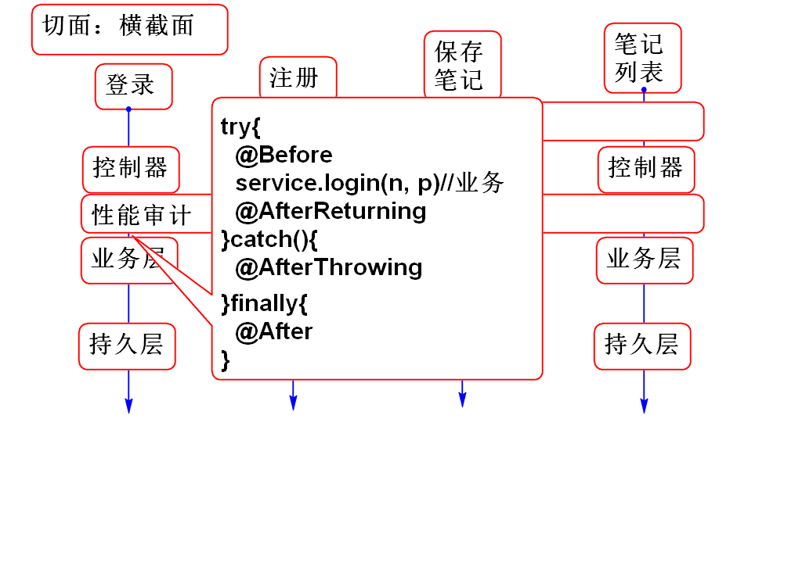
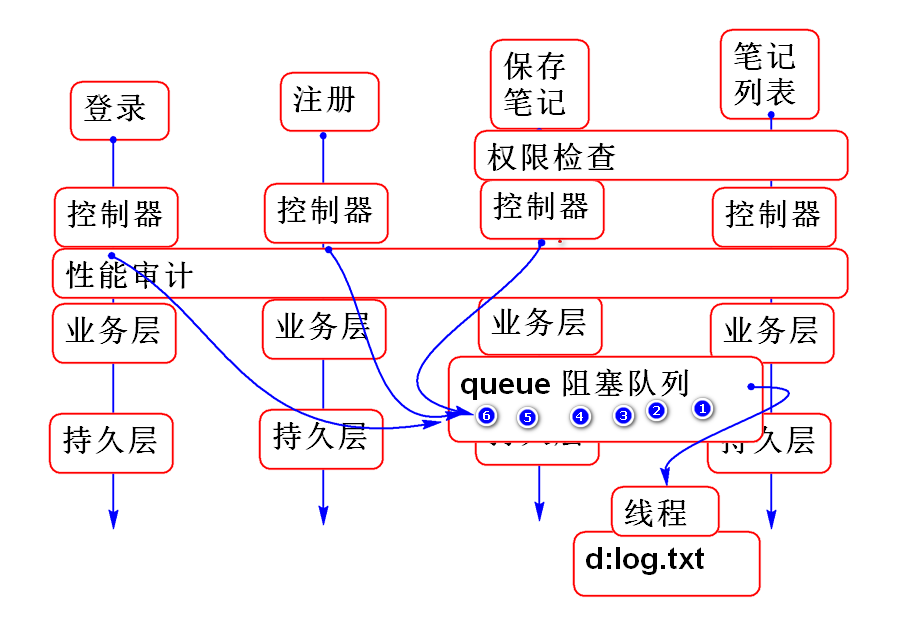
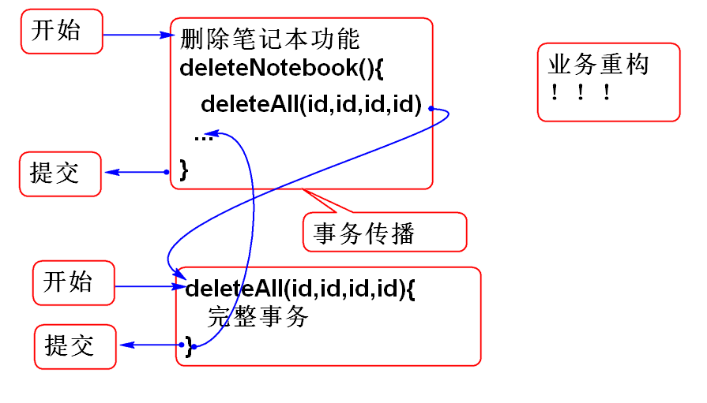

# Spring

## AOP

AOP 的优点：

在不改变原有程序的情况下插入（扩展）出功能，一般都是切向（横截面）功能。

用途： 切向（横截面）功能扩展： 日志，功能审计，性能追踪等。

### 通知

用于表示切面程序相对以被拦截方法的调用位置

如：

@Before 在业务方法之前调用

@AfterReturning 在业务方法正常（没有异常）结束以后调用

@AfterThrowing 在业务方法出现以后异常调用

@Arter 无论业务方法是否出现异常，都会调用

@Around 在业务方法周围调用

案例：

	@Before("bean(userService)")
	public void before(){
		System.out.println("Before");
	}
	
	@AfterReturning("bean(userService)")
	public void afterReturning(){
		System.out.println("AfterReturning");
	}
	
	@AfterThrowing(pointcut="bean(userService)"
			,throwing="ex")
	public void afterThrowing(Exception ex)
		throws Exception{
		System.out.println("AfterThrowing");
		throw ex;
	}
	
	@After("bean(userService)")
	public void after(){
		System.out.println("After");
	}
	
	//环绕
	@Around("bean(*Service)")
	public Object around(
			ProceedingJoinPoint joinPoint)	
			throws Throwable{
		System.out.println("开始");
		//调用业务方法
		Signature m=joinPoint.getSignature();
		System.out.println(m);//输出方法签名
		Object value=joinPoint.proceed();
		System.out.println("结束");
		return value;//业务方法的返回值
	}

> 提示：	@Around 中joinPoint是连接点对象，调用joinPoint.proceed()，可以执行后续业务方法，joinPoint.getSignature()可以获取当前调用方法的签名信息。

### 切入点（织入位置）

是将AOP组件织入到哪个类的那个方法。

> 提示：找到方法以后，在方法的前后位置由 “通知” 决定

Bean 组件切入
	
	bean(组件ID)
	
	如：
	bean(userService)
	bean(*Service)

类切入点：

	within(类全名)	
	
	如：
	within(cn.tedu.note.service.UserServiceImpl)
	within(cn.tedu.note.service.*)
	within(cn.tedu.note.service..*)

方法切入点：

	execution(修饰词 方法全名(参数))
	
	如：
	execution(* cn.tedu.note.service.*Service.*(..))
	execution(* cn.tedu.note.service.*.*(..))
	execution(* cn.tedu.note.service..*(..))
	
> 建议利用统一命名规范，规范包、类、方法的命名，才能更好的设计切入点表达式！

### AOP 案例： 方法性能审计

原理：

在项目中导入 AOP支持包：

	<!-- AOP -->
	<dependency>
	  <groupId>org.aspectj</groupId>
	  <artifactId>aspectjweaver</artifactId>
	  <version>1.8.8</version>
	</dependency>
	<dependency>
	  <groupId>org.aspectj</groupId>
	  <artifactId>aspectjtools</artifactId>
	  <version>1.8.8</version>
	</dependency>
	<dependency>
	  <groupId>org.aspectj</groupId>
	  <artifactId>aspectjrt</artifactId>
	  <version>1.8.8</version>
	</dependency>	

添加APO支持配置文件 spring-aop.xml:

	<?xml version="1.0" encoding="UTF-8"?>
	<beans xmlns="http://www.springframework.org/schema/beans" 
		xmlns:xsi="http://www.w3.org/2001/XMLSchema-instance"
		xmlns:context="http://www.springframework.org/schema/context" 
		xmlns:jdbc="http://www.springframework.org/schema/jdbc"  
		xmlns:jee="http://www.springframework.org/schema/jee" 
		xmlns:tx="http://www.springframework.org/schema/tx"
		xmlns:aop="http://www.springframework.org/schema/aop" 
		xmlns:mvc="http://www.springframework.org/schema/mvc"
		xmlns:util="http://www.springframework.org/schema/util"
		xmlns:jpa="http://www.springframework.org/schema/data/jpa"
		xsi:schemaLocation="
			http://www.springframework.org/schema/beans http://www.springframework.org/schema/beans/spring-beans-3.2.xsd
			http://www.springframework.org/schema/context http://www.springframework.org/schema/context/spring-context-3.2.xsd
			http://www.springframework.org/schema/jdbc http://www.springframework.org/schema/jdbc/spring-jdbc-3.2.xsd
			http://www.springframework.org/schema/jee http://www.springframework.org/schema/jee/spring-jee-3.2.xsd
			http://www.springframework.org/schema/tx http://www.springframework.org/schema/tx/spring-tx-3.2.xsd
			http://www.springframework.org/schema/data/jpa http://www.springframework.org/schema/data/jpa/spring-jpa-1.3.xsd
			http://www.springframework.org/schema/aop http://www.springframework.org/schema/aop/spring-aop-3.2.xsd
			http://www.springframework.org/schema/mvc http://www.springframework.org/schema/mvc/spring-mvc-3.2.xsd
			http://www.springframework.org/schema/util http://www.springframework.org/schema/util/spring-util-3.2.xsd">
	
		<!-- 扫描到控制器组件 -->
		<context:component-scan 
			base-package="cn.tedu.note.aop"/>
		<!-- 用于支持注解版的AOP @Aspect -->
		<aop:aspectj-autoproxy/>
		
		<util:properties id="config" 
			location="classpath:config.properties"/>
	</beans>

添加属性文件 config.propreties:

	# resource/config.properties
	filename=d:/log.txt
	
添加 切面组件：

	@Component
	@Aspect
	public class TimeLogerAspect {
		
		private BlockingQueue<String> queue=
			new LinkedBlockingQueue<String>(500);
		
		
		private String filename;
		@Value("#{config.filename}")
		public void setFilename(String filename) {
			this.filename = filename;
			file = new File(filename);
		}
		
		private File file;
		
		private Thread writer;
		
		public TimeLogerAspect() {
			writer = new Thread(){
				@Override
				public void run() {
					while(true){
						try{
							if(queue.isEmpty()){
								Thread.sleep(500);
								continue;
							}
							//发现队列中有数据
							PrintWriter out=
								new PrintWriter(
								new FileOutputStream(file, true)); 
							while(! queue.isEmpty()){
								String str=queue.poll();
								out.println(str);
							}
							out.close();
						}catch(Exception e){
							e.printStackTrace(); 
						}
					}
				}
			};
			writer.start();
		}
		
		@Around("execution(* cn.tedu.note.service.*Service.*(..))")
		public Object proc(
			ProceedingJoinPoint joinPoint)
			throws Throwable{
			long t1=System.nanoTime();
			Object val = joinPoint.proceed();
			long t2=System.nanoTime();
			Signature s=joinPoint.getSignature();
			//System.out.println(
			//	System.currentTimeMillis()+":"+
			//	s+":"+(t2-t1));
			String str = 
				System.currentTimeMillis()+":"+
				s+":"+(t2-t1);
			queue.offer(str);
			return val;
		}
	}

> 这个切面组件记录了每个业务方法的执行时间，在利用生产者消费者模型，异步的将数据写入到文件中。

测试:...

## 声明式事务管理

事务：保护原子性业务操作，保证这个操作一次完成，或者在出现故障时候回退。不能出现中间状态。

### 程序控制事务

可以利用Java代码控制事务处理：

程序控制事务：

	try{
		开启事务
		事务业务操作
		事务业务操作
		事务业务操作
		提交事务
	}catch(Exception e){
		回滚事务
	}finally{
		释放资源
	}

缺点：事务与业务绑定，耦合过紧，不便于业务重构。

### 声明式事务处理
	
Spring 利用 AOP 技术实现了 声明式事务处理。无需编程即可控制程序中的事务！只需要添加 事务 注解即可！！大大简化了事务程序开发。

Spring中必要的配置 spring-mybatis.xml：

	<!-- 配置Spring JDBC 中的数据源事务管理 -->
	<bean id="txManager"
		class="org.springframework.jdbc.datasource.DataSourceTransactionManager">
		<property name="dataSource"
			ref="dataSource"/>
	</bean>
	
	<!-- 声明: 可以使用注解式事务处理了 -->
	<tx:annotation-driven	
		transaction-manager="txManager"/>

	
使用声明式事务：	

	@Transactional
	public Object 业务方法(){
		业务过程
		添加数据
		删除数据
		修改数据
		添加数据
	}

> 基本规则: 业务方法的整体看做一个事务，如果业务方法正常结束（没有异常），则业务完整提交。如果业务过程中抛出任何异常，正业务过程整体回滚，回滚到业务方法运行之前的情况。

案例：

	deleteAll(id1, id2, id3, id4, id5, id6)
	
	//业务接口方法
	void deleteAll(String... noteId);
	
	//业务接口实现
	@Transactional
	void deleteAll(String... noteId){
		noteId 就是数组
	}

> 变长参数就是数组，String... String[] 一样

案例：批量删除笔记：

NoteService.java:

	//NoteService 中增加批量删除方法
	int deleteAll(String... noteId);

NoteServiceImpl.java:

	@Transactional
	public int deleteAll(String... noteId) {
		int n=0;
		for (String id : noteId) {
			int c=noteDao.countNotesById(id);
			if(c==0){
				throw new NoteNotFoundException(id);
			}
			noteDao.deleteNote(id);
			n++;
		}
		return n;
	}

NoteDao.java:

	void deleteNote(String id);

NoteMapper.xml:

	<delete id="deleteNote"
		parameterType="string">
		delete from cn_note
		where cn_note_id=#{id}	
	</delete>

测试：关注是否发生事务回滚现象：

	@Test
	public void testDeleteAll(){
		String id1="3febebb3-a1b7-45ac-83ba-50cdb41e5fc1";
		String id2="9187ffd3-4c1e-4768-9f2f-c600e835b823";
		String id3="ebd65da6-3f90-45f9-b045-782928a5e2c0";
		String id4="fed920a0-573c-46c8-ae4e-368397846efd";
		NoteService service = ctx.getBean(
			"noteService", NoteService.class);
		int n = service.deleteAll(
			id1, id2, id3, id4);
		System.out.println(n);
	}

## 声明事务特性

###  只读属性

	@Transactional(readOnly=true)
	public List<Map<String, Object>> 
		listNotebooks(String userId){
		//...
	}

### 事务的隔离：

	@Transactional(isolation=Isolation.DEFAULT)

事务的隔离级别

串行操作（一个接一个处理）不并发，数据安全性，一致性最高，性能最差（用户体验差）：

	isolation=Isolation.SERIALIZABLE

可重复读取，保证每次读取数据是一致的，性能不好：

	isolation=Isolation.REPEATABLE_READ

可以读取以提交的数据，一般是默认级别，最常用的：
	
	isolation=Isolation.READ_COMMITTED
	isolation=Isolation.DEFAULT

可以读取没有提交的中间数据，不建议用：

	isolation=Isolation.READ_UNCOMMITTED

一般情况下，都使用默认的隔离级别。

### 事务的传播

原理：

案例：

NotebookService.java:

	void deleteNotebook(String id);

NotebookServiceImpl.java:

	@Resource
	private NoteService noteService;
	
	@Transactional(
		propagation=Propagation.REQUIRED)
	public void deleteNotebook(String id) {
		
		List<Map<String, Object>> list=
			noteService.listNotes(id);
		for (Map<String, Object> map : list) {
			String noteId=(String)map.get("id");
			noteService.deleteAll(noteId);
		}
		//String s=null;
		//s.length();
		notebookDao.deleteNotebook(id);
	}

测试，关注点：事务是否在多个业务方法之间传播了：

	@Test
	public void testDeleteNotebook(){
		//测试事务的传播特性
		String id="d92e6b86-e48a-485d-8f11-04a93818bb42";
		NotebookService service=
			ctx.getBean("notebookService",
			NotebookService.class);
		service.deleteNotebook(id); 
	}

	